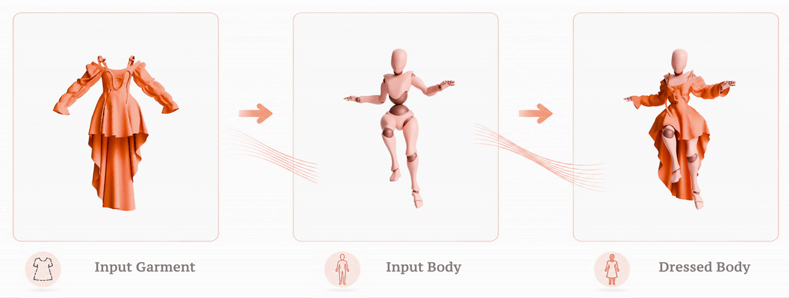

# LUIVITON: Learned Universal Interoperable VIrtual Try-ON



This is a repository for the paper
[**Learned Universal Interoperable Virtual Try-ON**](https://dl.acm.org/doi/10.1145/3811307)
(**SIGGRAPH 2026 / ACM Transactions on Graphics (TOG)**).

[**Video**](https://youtu.be/ctG9DeKy6jc?si=3vRvIJJdMidDjxAt) |
[**Project Page**](https://cao-cong0.github.io/LUIVITON-Learned-Universal-Interoperable-VIrtual-Try-ON/) |
[**Clothing-SMPL Correspondence Data**](https://drive.google.com/file/d/1wEQ2Wae6WQKCvS2nY0O94qv0xE2x8Gxa/view?usp=drive_link)


## Installation

Linux with an NVIDIA CUDA GPU is required. The correspondence and registration environment uses:

1. Python **3.10**
2. PyTorch **2.0.1**
3. CUDA runtime **11.7**
4. torchvision **0.15.2**
5. PyTorch3D **0.7.4**

Run from the repository root:

```bash
sudo apt-get install build-essential libboost-dev libgl1 libglu1-mesa libglib2.0-0
conda env create -f env/Luiviton.yml
conda activate Luiviton
pip install -e .
bash scripts/setup_third_party.sh
```

The setup script initializes the third-party submodules, installs [MPI-IS/mesh](https://github.com/MPI-IS/mesh),
and applies the LUIVITON patches.

For clothing transfer, create a separate `ccraft` environment following
[ContourCraft's installation instructions](https://github.com/Dolorousrtur/ContourCraft).
Then run:

```bash
conda activate ccraft
pip install -e .
```

## Layout

- `correspondence/`: body and clothing correspondence.
- `mesh_reconstruct/`: body mesh reconstruction.
- `smpl_registration/`: shared body and clothing fitters.
- `luiviton/`: clothing pipeline API and CLI.
- `scripts/` and `configs/`: setup, pipeline commands, and configuration.
- `integrations/` and `third_party/`: upstream patches and dependencies.
- `models/` and `assets/`: checkpoints, templates, and source features.
- `outputs/`: generated results.

## Assets

Download the ContourCraft checkpoint, SMPL model, and auxiliary data using the
[asset setup guide](external/CONTOURCRAFT_SETUP.md). Then link the SMPL models for registration:

```bash
conda run -n Luiviton bash scripts/setup_rvh.sh
```

Registration requires RVH's
[body_prior.pkl](https://github.com/bharat-b7/RVH_Mesh_Registration/blob/main/assets/priors/body_prior.pkl)
at `third_party/RVH_Mesh_Registration/assets/priors/body_prior.pkl`.

Bundled assets:

- `models/cloth_correspondence.pth`: clothing correspondence checkpoint.
- `models/smpl_uv_free.obj`: clothing correspondence and registration template.
- `assets/source_smpl/smpl_wide.obj`: reference mesh defining body correspondence indices.
- `assets/source_smpl/smpl_features_18_views_0.pt`: source features (`6890 x 2688`, `float16`).

## Full Pipeline

Provide a body OBJ and a clothing OBJ. The clothing must be in a rest pose between A-pose and T-pose:

```bash
bash scripts/run_pipeline.sh /path/to/body.obj /path/to/cloth.obj
```

The runner uses `Luiviton` for correspondence and registration, then `ccraft` for transfer.
The final garment is saved to `outputs/garment/transferred/`.
Set `OUTPUT_ROOT=outputs/my_run` to use a separate output directory.

Resume after body reconstruction and SyncMVD:

```bash
RUN_RECONSTRUCTION=0 RUN_SYNCMVD=0 \
bash scripts/run_pipeline.sh /path/to/body.obj /path/to/cloth.obj
```

Run only transfer with existing body and clothing registrations:

```bash
RUN_BODY=0 RUN_CLOTH_REGISTRATION=0 \
bash scripts/run_pipeline.sh /path/to/body.obj /path/to/cloth.obj
```

## Individual Stages

Body reconstruction only (also included in body processing):

```bash
mkdir -p outputs/body/reconstructed_meshes
conda run -n Luiviton python mesh_reconstruct/watertight_3d_scan.py \
  --input_obj_path /path/to/body.obj \
  --output_obj_path outputs/body/reconstructed_meshes/body.obj
```

Body correspondence and registration:

```bash
conda run -n Luiviton bash scripts/full_body_registration.sh configs/paths.example.sh
```

Clothing correspondence, registration, and transfer options:

```bash
conda run -n Luiviton python -m luiviton correspondence --cloth cloth.obj
conda run -n Luiviton python -m luiviton register --cloth cloth.obj
conda run -n ccraft python -m luiviton transfer --help
```

Existing clothing correspondence and registration outputs are reused unless `--overwrite` is supplied.


## Citation

```bibtex
@article{10.1145/3811307,
  author = {Cao, Cong and Cheng, Xianhang and Liu, Jingyuan and Zheng, Yujian and Lin, Zhenhui and Li, Ren and Chkir, Meriem and Li, Hao},
  title = {Learned Universal Interoperable Virtual Try-ON},
  year = {2026},
  issue_date = {July 2026},
  publisher = {Association for Computing Machinery},
  address = {New York, NY, USA},
  volume = {45},
  number = {4},
  issn = {0730-0301},
  url = {https://doi.org/10.1145/3811307},
  doi = {10.1145/3811307},
  journal = {ACM Trans. Graph.},
  month = jul,
  articleno = {156},
  numpages = {14}
}
```
